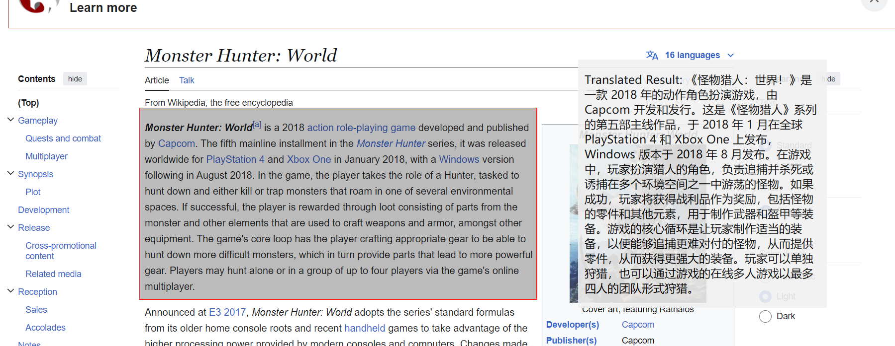
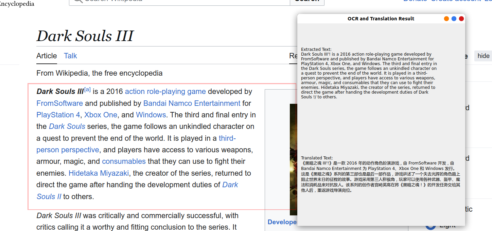

# OCR Translation Software

## Motivation
The motivation behind this project is to explore how ChatGPT can assist someone with limited coding knowledge in creating useful scripts. As seen from my GitHub repository, my coding skills are not highly developed. Although coding in Python is one of my interests, I typically use it only for data analysis in my work as a physicist. Engaging with ChatGPT to create something new has been an intriguing experience.

## How to Do It
In this project, I provide prompts such as:
```
generate python code to capture certain area of screen,display a box in selected area, ocr the text, tranlate to english, show it in a window, refresh the ocr result every 0.5s, make the code able to run on windows
```
and
```
draw a red box by pyqt, make it always on top, always show. perform ocr for area inside the box, output text obtained from ocr to another window
```

These prompts help ChatGPT generate code for me. Some minor modifications are usually required to make the code run more smoothly, which takes up about 90% of the time(totally ~ 6h). I find it relatively easy to get a decent initial output, but adjusting it to fit specific needs can lead to unique results.

My process involves copying and pasting code to execute it, understanding the output, and then informing ChatGPT about any issues to resolve or next steps to take. I believe that anyone with basic command line knowledge could achieve similar results. One frustrating issue I encountered is that ChatGPT tends to take my prompts very literally, making it difficult to retract the last prompt and revert to a previous output. A better approach might be to start a new conversation.

## About the Software
The software features a preset selected area that performs OCR and translates the obtained text to simplified Chinese every 0.5 seconds, outputting the results to another window. The OCR area can be dragged and resized, while the result window can only be moved, with size adjustments available in `ocr5.py`. The [ocr.exe](https://github.com/HaoleiH/ocr_test/releases/tag/ocr) file (260MB) can be executed independently on Windows. To run [ocr5.py](https://github.com/HaoleiH/ocr_test/blob/main/ocr5.py), several packages need to be installed. A list of the packages I used is available in [toy2.yml](https://github.com/HaoleiH/ocr_test/blob/main/toy2.yml). In addition, there is one Ubuntu version which has different features, since it is generated by slightly different prompts.The [draw_translate](https://github.com/HaoleiH/ocr_test/releases/tag/draw_translatev1.0) file can be excuted indenpendly on Ubuntu. To run [draw_translate.py](https://github.com/HaoleiH/ocr_test/blob/main/draw_translate.py), several packages need to be installed. check [toy.yml](https://github.com/HaoleiH/ocr_test/blob/main/toy2.yml).

All windows are created using [PyQt](https://pypi.org/project/PyQt5/). The OCR functionality is provided by [Tesseract OCR](https://github.com/tesseract-ocr/tesseract) and [pytesseract](https://pypi.org/project/pytesseract/). The translation feature is powered by [deep-translator](https://github.com/nidhaloff/deep-translator). The scripts are packed to stand-alone excutables by [pyinstaller](https://github.com/pyinstaller/pyinstaller). I utilized the free plan of [ChatGPT](https://chatgpt.com) to generate this code, and I had no prior knowledge of these packages before this project. ChatGPT suggested these packages, which I then installed.

BTW, this file is also revised by ChatGPT.

Following picture shows a preview of the output when runing ocr5.py or ocr.exe on windows.



Following picture shows a preview of the output when runing draw_tranlate.py or drawtanslate on ubuntu 18.04 LTS.
