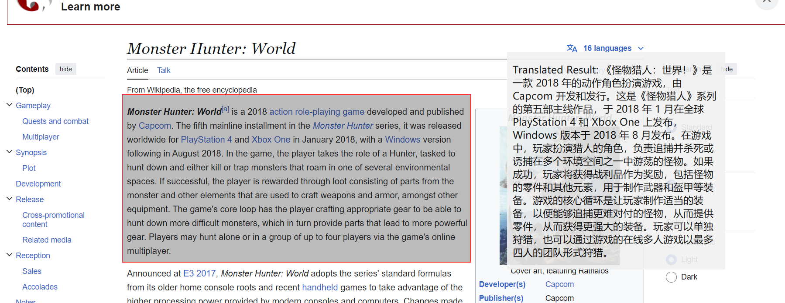

# A ocr-translation software
## The motivation
The motivation of this project is that I want to test how ChatGPT can help a person who has no realted knowledge to make some useful scripts. Based on the this github repository, you can see that I am not well trained for coding. Coding in python is just one of my interests. As a physicsist I usually use python just to analysize data. "Talking" to ChatGPT to create something new is a strange experience. 

## How to do it
In this project, I proveide prompt such as 
```
generate python code to capture certain area of screen,display a box in selected area, ocr the text, tranlate to english, show it in a window, refresh the ocr result every 0.5s, make the code able to run on windows
```
and
```
draw a red box by pyqt, make it always on top, always show. perform ocr for area inside the box, output text obtained from ocr to another window
```
to make ChatGPT generate code for me. Some minor changes need to be done to make the code run smoother, which takes 90% of the time. I have a feeling that it is easy to make a generally not bad output, then adjusting it to what you desire can lead to very peculiar result.

What I have done is just copy and paste code to excute, understand the output, then tell ChatGPT what issue to solve or what to do next. I believe anyone with basic command line knowledge can do it as good as I do. one frastrating problem I encountered is that ChatGPT treat my prompt so seriously that I can not withdraw my last prompt and go back to last last output. Better choice might be starting a new conversition.
## About the software
For the software, it has a preset selected area, and performs ocr and translates obtained text to Chinese(simplified) every 0.5s, then output result to another window. the ocr area can be dragged and resized. The result window can only be dragged and the size can only be adjust in ocr5.py. The [ocr.exe file(260MB)](https://github.com/HaoleiH/ocr_test/releases/tag/ocr) can be excuted on Windows alone. To run [ocr5.py](https://github.com/HaoleiH/ocr_test/blob/main/ocr5.py), some packages need to be installed. A list of packages I used is shown in [toy2.yml](https://github.com/HaoleiH/ocr_test/blob/main/toy2.yml).

All the windows are created by [PyQt](https://pypi.org/project/PyQt5/). The OCR part is done by [Tesseract OCR](https://github.com/tesseract-ocr/tesseract) and [pytesserat](https://pypi.org/project/pytesseract/). The translation part is done by [deep-translator](https://github.com/nidhaloff/deep-translator). [ChatGPT](chatgpt.com) free plan is used to generate these code. I don't have any knowledge on these packages before this project. ChatGPT used these package so I just installed them.

Following picture shows a preview of the output.

